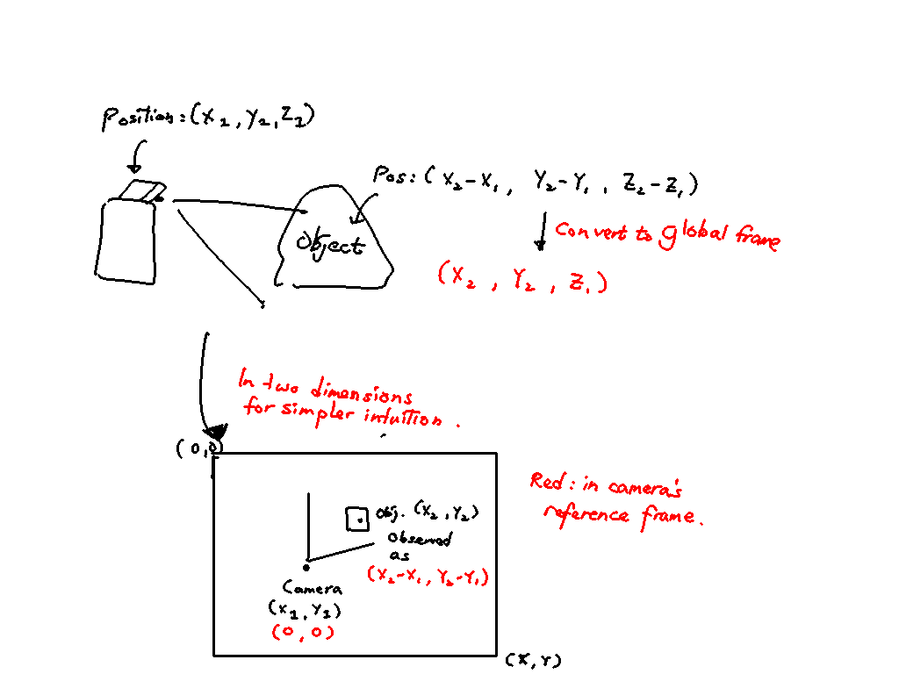

I wrote the following on the [JIRA](https://imda-dsl.atlassian.net/browse/VAMA-21):

## Description

The Scene Understanding Manager (SUM) lives on the Amazon EC2 instance.
Broadly speaking, it needs to receive 2D bounding box data from the Scene
Understanding Module living on the NVIDIA Jetson, and publish 3D bounding box
data over ROS for consumption by other RMF_core modules such as the RMF
Traffic Schedule Class.

Ask Eric:

- How does the SUManager convert 2D bounding box data to 3D bounding polygon
  data? Does it also need the Webcam stream or will the bounding box alone be
  sufficient?
- Is the SUManager a machine learning model? How will the EC2 instance be able to run it?

Ask Xiaolei and Eric:

- Is the following the correct understanding of the pipeline?

### The Converter Class

The Converter converts the 3DBoundingPoly in the camera’s reference frame to
a 3DBoundingPoly in the global reference frame of the RMFTrafficMap. To do
this, we’ll need the position of the camera in the global reference frame. I
drew a very quick diagram to build intuition:

---

## What needs to be done

1. Deploy the object detection model on the Jetson
   - First deploy a "Hello World" model on the Jetson just to make sure the pipeline works
   - Then find a way to import the scientists' model into the pipeline
2. Send the results of the object detection model (2DBoundingBox) to the EC2 instance
3. Build some model that processes the results of the object detection model
   and returns a 3DBoundingPoly
4. Build a converter class that converts the 3DBoundingPoly in the camera’s reference frame to
   a 3DBoundingPoly in the global reference frame of the RMFTrafficMap
5. Publish that 3DBoundingPoly as a ROS2 message to the RMFTrafficSchedule class.

I added a new child issue to the JIRA:

Description

We want to convert the scientists' model to run on the NVIDIA Jetson. So the
first step is to first deploy and run a “Hello World” DeepStream model on the
Jetson just to make sure the I/O is correct.

Once we get this sorted out we can then proceed to import the scientists' model.

[DeepStream Getting Started](https://developer.nvidia.com/deepstream-getting-started)

I installed DeepStream SDK 5.0 and other prerequisite libraries like Gst
Python v1.14.5.

I followed [this HOWTO](https://github.com/NVIDIA-AI-IOT/deepstream_python_apps/blob/master/HOWTO.md)
to run the basic model.

However, I had a problem running the model. Googling didn’t help and so I
posted it on the forums
[here](https://forums.developer.nvidia.com/t/cannot-run-deepstream-test-1-in-deepstream-python-apps-where-is-the-samples-folder/156010).
Hopefully someone should reply soon. If that
doesn’t work out, I will look at
[this course](https://courses.nvidia.com/courses/course-v1%3ADLI%2BC-IV-02%2BV1/course/).
