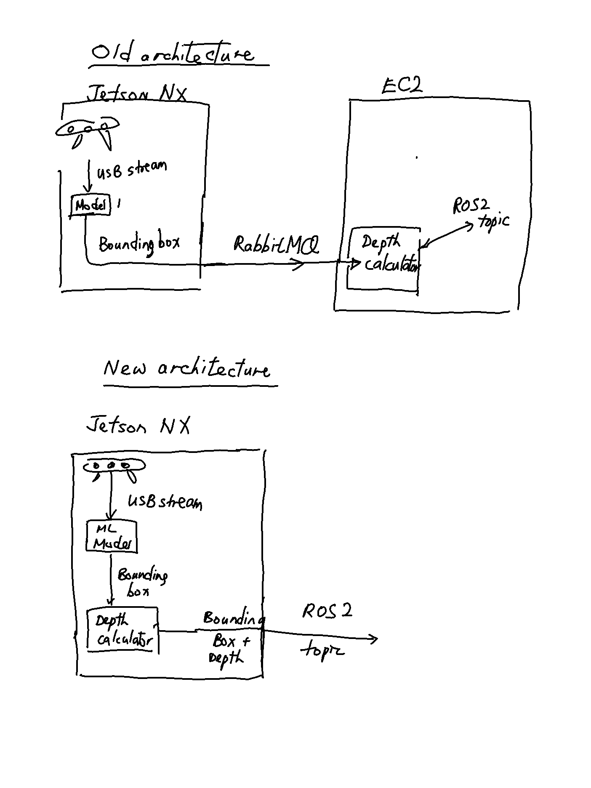

# Comparing the old and the new architecture

In this document I compare the new and old architecture design
of the Scene Understanding Manager of the VAMA project.

There are two key differences between the old and new architecture designs:

1. Depth calculator is done on-device (new) vs on central server (old)
2. Data is sent from Jetson NX to central server via ROS2 DDS (new) vs via RabbitMQ (old)

## Pros of the new architecture

- Since the depth data and the bounding box data are already on the Jetson,
  we can offload computation off of the central server, do it on-device
  and thus reduce CPU load/bandwidth.
  (Particularly if we have multiple ML models).

- We do not need to use an additional message broker library,
  thus decreasing software complexity.

## Cons of the new architecture

- After doing some research, it looks like it is difficult to/there is no support 
  to send messages over the Internet with ROS2.
  ROS2 seems to assume that all nodes are on the same network.
  This will be a problem if the central server is on a different network.
  Right now we are using a EC2 instance for the central server.
  We can send messages over to the EC2 instance using RabbitMQ
  but it would be significantly harder to do it using ROS2.

- Because each Jetson would have their own copy of the ML models,
  it might be more difficult to deploy and update the ML models.
  However, this might be a good thing if deploying a new ML model
  accidentally breaks existing functionality.
  With distributed ML models a botched ML model will only ever break one robot
  and not crash the entire system.

- The Jetson NX might not be able to handle multiple ML models on-device.

- Robot vendors might not want to mount the Jetson NX on their robots.

## Things I'm not sure about

- What is SLAM? How does it work? How do we get its outputs?
