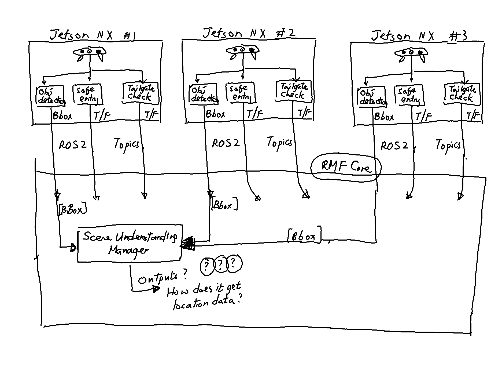

# Planning VAMA 2 Sprint 2 (2020-12-09)

## Comments on last sprint

- 

## Things that have changed since the previous architecture diagram

After discussion with Eric, we have decided to use a hybrid of the old and new approaches:

The scene understanding manager will be on the central server (old approach), 
but we will not use RabbitMQ to send out the messages.

## Things that are not in scope

We've decided that we will not worry about sending ROS2 topics over the Internet.
Nodes must be on the same local network.
This means that we cannot use an EC2 instance for the central server.

## Questions I have

- How does the SUM get location data?
- What exactly should SUM do to combine multiple bounding box inputs from the Jetsons?
- What should be the specific outputs of the SUM?
- Which modules in RMF core receive the ROS2 tailgating and lift safe entry topics?

## Backlog

- Confirm the architecture with Eric and Yifan
- Answer the questions that I still have
- Think about how best to collaborate with Xin Zheng (pair programming)
- Figure out how to test the SUM (since we can't use the EC2 instance)
- Figure out what the SUM should do 
- Develop the SUM (this should be broken down into subtasks)
- Publish bounding boxes as ROS2 topic 
- Deploy lift safe entry module on the Jetson
- Publish lift safe entry check as ROS2 topic
- Deploy lift tailgate check module on the Jetson
- Publish lift tailgate check as ROS2 topic
